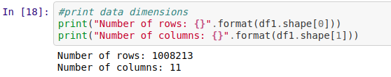
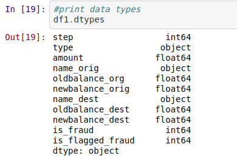
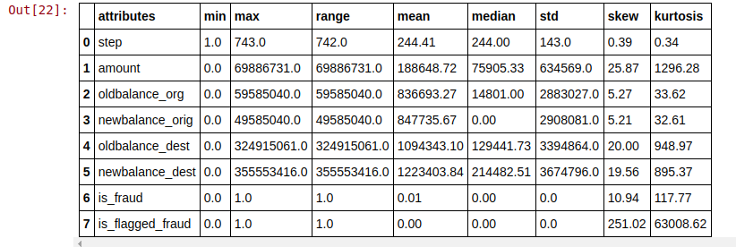
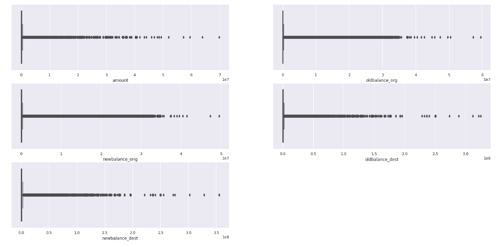
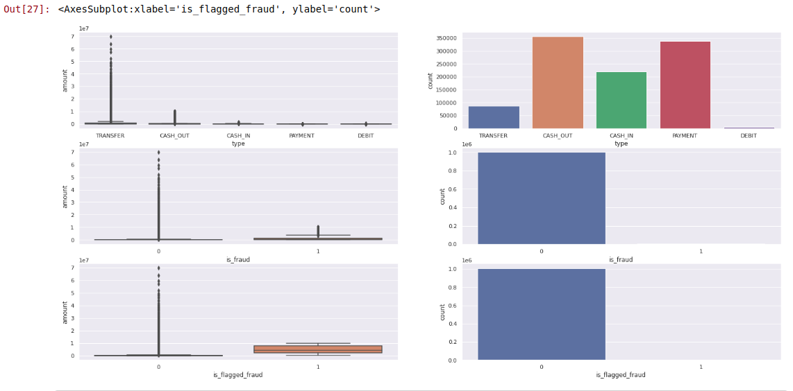
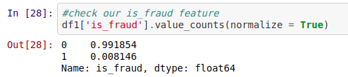

# Fraud Detection - Blocker Fraud Comapny
## Author: Jorge Barros | Data Scientist

There is a lack of public available datasets on financial services and specially in the emerging mobile money transactions domain. Financial datasets are important to many researchers and in particular to us performing research in the domain of fraud detection. Part of the problem is the intrinsically private nature of financial transactions, that leads to no publicly available datasets.

We present a synthetic dataset generated using the simulator called PaySim as an approach to such a problem. PaySim uses aggregated data from the private dataset to generate a synthetic dataset that resembles the normal operation of transactions and injects malicious behaviour to later evaluate the performance of fraud detection method

A fraudulent transfer, is an attempt to avoid debt by transferring money to another person or company. It is generally a civil, not a criminal matter, meaning that one cannot go to jail for it, but in some jurisdictions there is potential for criminal prosecution. It is generally treated as a civil cause of action that arises in debtor/creditor relations, particularly with reference to insolvent debtors. The cause of action is typically brought by creditors or by bankruptcy trustees.

# Business Problem

For the development of the project, we created a fictitious company called "Blocker Fraud Company", which is a company specialized in detecting fraud in financial transactions made through mobile devices. The company has a service called “Blocker Fraud” in which it guarantees the blocking of fraudulent transactions.

The company's business model is of the Service type with the monetization made by the performance of the service provided, that is, the user pays a fixed fee on the success in detecting fraud in the client's transactions.

However, the Blocker Fraud Company is expanding in Brazil and to acquire customers more quickly, it has adopted a very aggressive strategy. The strategy works as follows:

**1** - The company receives 25% of each transaction value truly detected as fraud.

**2** - The company receives 5% of each transaction value detected as fraud, however the transaction is legitimate.

**3** - The company gives back 100% of the value for the customer in each transaction detected as legitimate, however the transaction is actually a fraud.

**What do we need to show?**

- What is the model's Precision and Accuracy?
- How Reliable is the model in classifying transactions as legitimate or fraudulent?
- What is the Expected Billing by the Company if we classify 100% of transactions with the model?

Dataset: https://www.kaggle.com/ntnu-testimon/paysim1/notebooks?sortBy=hotness&group=everyone&pageSize=20&datasetId=1069&language=Python

# 1.0. DATA DESCRIPTION

## 1.1. Data Dimensions

Let's understand how big our dataset is. This will be important because a robust machine learning model needs a considerable amount of data to train our algorithm.

Although we have a lot of data, we need to know if our computational capacity is sufficient. If a problem appears during the project, it will be necessary to use a GPU.

## 1.2. Data Types

Apparently our dataset does not have inconsistent data types.

## 1.3. Descriptive Statistical

### 1.3.1. Numerical Attributes

- It's important to note that we don't have null values.
- is_flagged_fraud --> Most of the data in the "is_flagged_fraud" column is zero.
- oldbalance_org --> If we look at the median, which represents the intermediate value, we have the value of 14,691.00 However, the range is equal to 59,585,040.00, which is very high. This variable will need to be checked soon.
- newbalance_org, oldbalance_dest, newbalance_dest, amount --> Respects the same behavior as the oldbalance_org variable

### 1.3.2. Categorical Attributes

- Only 0.8% of our data is considered fraudulent.
- High presence of outliers who transferred to our type variable.
- Cash_out is the most common form of payment, followed by payment.

# 2.0. MindMap Hypothesis

